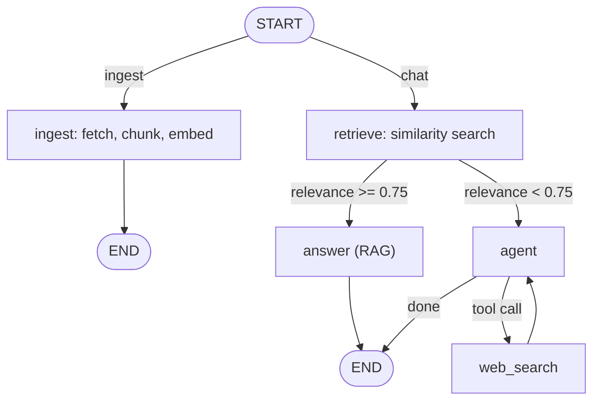

# Chat with YouTube Videos

Paste a YouTube link and ask questions about the video. The app fetches the
transcript, embeds it, and answers with RAG over that transcript. When a question
isn't covered by the video, an agent decides whether to fall back to a Tavily web
search and cite its sources.

Next.js (App Router) + LangGraph, Google Gemini for the LLM and embeddings, Tavily
for web search, and Ant Design for the UI.

## What it does

- Accepts a YouTube URL in any format — `youtube.com/watch?v=…`, `youtu.be/…`,
  `/shorts/…`, `/embed/…`, `/live/…`, or a bare 11-char id.
- Returns a clear error when a video has no usable transcript/captions.
- Answers questions about the video (summary, main points, who's speaking, the
  creator) grounded in the transcript and the video's metadata.
- For questions the video doesn't cover, the model decides: say it isn't
  mentioned, or run a web search when an external answer would actually help, and
  return the answer with its top source links.
- Streams answers token by token and tags whether each came from the transcript
  or a web search.

## Architecture

The client sends a URL to `/api/ingest`, then one message at a time to
`/api/chat`. The logic lives in a single compiled LangGraph `StateGraph` with a
SQLite checkpointer.



- Two entry modes: a conditional edge from `START` routes ingest vs chat.
- The relevance decision is a conditional edge — `retrieve` scores the question
  against the transcript and routes to the RAG `answer` node or to the `agent`.
- The agent binds a `web_search` tool and decides per question whether to answer
  from the video, say it isn't covered, or search the web (an agent/tools loop).
- Per-thread context is checkpointed once: on ingest the overview, chunks and
  embeddings are written to the thread's checkpoint and read back each turn, so
  the client never re-sends the transcript or history.
- A persistent `SqliteSaver` is keyed by `thread_id` (the video id), so reopening
  a video keeps the conversation.
- Every node has a `retryPolicy` (backoff + jitter); the expensive ingest and
  retrieve nodes have a `cachePolicy` backed by an `InMemoryCache`.

### Note on the 0.75 threshold

`gemini-embedding-001` is asymmetric, so the transcript is embedded as
`RETRIEVAL_DOCUMENT` and the question as `RETRIEVAL_QUERY`. On the test video it
scores relevant questions ~0.65–0.80 and off-topic ones ~0.50–0.55 — a clean gap,
but well below 0.75. `retrieve` maps that cosine band onto a 0–1 relevance score
and compares that to 0.75, so relevant questions clear it and off-topic ones fall
through to the agent.

## Tech stack

| Concern | Choice |
| --- | --- |
| Framework | Next.js 16 (App Router, JS/JSX) |
| Orchestration | LangGraph (`@langchain/langgraph`) |
| LLM + embeddings | Google Gemini (`gemini-3.5-flash-lite`, `gemini-embedding-001`) |
| Vector search | `MemoryVectorStore` (`@langchain/classic`), cosine similarity |
| Web search | Tavily (`@langchain/tavily`), called as a model tool |
| Transcript | `youtube-transcript-plus` + `youtubei.js` |
| Persistence | SQLite checkpointer (`@langchain/langgraph-checkpoint-sqlite`) |
| UI | Ant Design |

## Getting started

Requires Node.js 20+ (builds `better-sqlite3` on install), a free Gemini API key
(https://aistudio.google.com/) and a free Tavily API key (https://tavily.com/).

```bash
npm install
cp .env.example .env.local   # add your keys
npm run dev                  # http://localhost:3000
```

### Environment variables

| Variable | Required | Default | Purpose |
| --- | --- | --- | --- |
| `GOOGLE_API_KEY` | yes | — | Gemini chat + embeddings |
| `TAVILY_API_KEY` | yes | — | Web search |
| `GEMINI_MODEL` | no | `gemini-3.5-flash-lite` | Chat model |
| `EMBEDDING_MODEL` | no | `gemini-embedding-001` | Embedding model |
| `SIMILARITY_THRESHOLD` | no | `0.75` | Below this relevance → web search (see note above) |
| `CHECKPOINT_DB` | no | `./data/checkpoints.sqlite` | SQLite checkpoint file |

### Scripts

```bash
npm run dev     # dev server
npm run build   # production build
npm start       # run the build
npm run lint    # eslint
```

### Test video

Try `https://www.youtube.com/watch?v=U9mJuUkhUzk` — ask for a summary, the main
points or the speaker, then ask something off-topic (e.g. the weather) to see the
web-search fallback with sources.

## Deployment

Needs a Node.js runtime (`better-sqlite3` isn't available on edge) and, because
the checkpoint file and vector store are local, a single instance with a
persistent disk — Render, Railway, or a Docker-based Hugging Face Space. Keep
`CHECKPOINT_DB` on the mounted volume and set `GOOGLE_API_KEY` / `TAVILY_API_KEY`
in the host environment. On Vercel the filesystem is ephemeral, so swap
`SqliteSaver` for the Postgres checkpointer.
