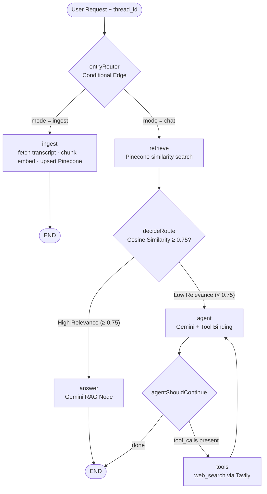
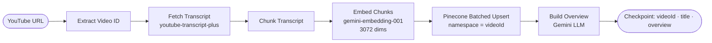

# AI Chat with YouTube Videos (LangGraph RAG + Pinecone)

[](LICENSE)
[](https://nextjs.org/)
[](https://js.langchain.com/docs/langgraph)
[](https://www.pinecone.io/)

A fullstack RAG-powered application that enables users to input any YouTube video link (`youtube.com/watch?v=…`, `youtu.be/…`, `/shorts/…`) and chat naturally with its transcript using Google Gemini models, Pinecone cloud vector similarity search (3072 dimensions), and an automated Tavily Web Search tool fallback when cosine similarity is below **0.75**.

---

## 🌟 Key Features

- **LangGraph Stateful Graph Workflow**: Single compiled `StateGraph` with two entry modes — `ingest` and `chat` — routed via `addConditionalEdges` at `START`, backed by a persistent SQLite checkpointer.
- **Pinecone Vector DB (3072 Dimensions)**: Stores and indexes transcript chunk embeddings generated by `gemini-embedding-001` (3072 dimensions) with batched upserts, isolated per video via Pinecone namespaces.
- **Universal YouTube Transcript Parsing**: `youtube-transcript-plus` + `youtubei.js` for reliable transcript extraction across multiple URL formats.
- **RAG → Agent Routing via Conditional Edges**: `retrieveNode` scores the question with cosine similarity; `addConditionalEdges` routes to the RAG `answer` node (≥ 0.75) or the `agent` node (< 0.75). No branching inside API routes.
- **Tool-Calling Web Search Fallback**: Web search is a formal LangChain tool (`webSearchTool`). The agent decides per question whether to answer from the transcript, say it isn't covered, or call Tavily and return the answer with top source URLs.
- **Per-User Chat Isolation**: `thread_id` is `${sessionId}_${videoId}`, where `sessionId` is a UUID generated per browser and persisted in `localStorage`. Each user gets an independent chat history for every video.
- **Token Streaming**: Answers stream token-by-token via `stream()` with `streamMode: ["updates", "messages"]`.
- **Node-Level Retry Policies**: Every node has `retryPolicy` (exponential backoff + jitter). The expensive `ingest` and `retrieve` nodes also have a `cachePolicy` backed by `InMemoryCache`.
- **History via Graph State**: Chat history is exposed through `graph.getState()` at `GET /api/history`, not client-side state.

---

## 📊 LangGraph Architecture Diagrams

### Main Graph Workflow



### Ingestion Flow (inside `ingest` node)



---

## 🛠️ Tech Stack

| Concern | Choice |
| --- | --- |
| Framework | Next.js 16 (App Router, JS/JSX) |
| Orchestration | LangGraph JS (`@langchain/langgraph`) |
| LLM | Google Gemini `gemini-3.5-flash-lite` |
| Embeddings | Google Gemini `gemini-embedding-001` (3072 dims, asymmetric) |
| Vector DB | Pinecone (`@pinecone-database/pinecone`) |
| Web Search | Tavily (`@langchain/tavily`), called as a model tool |
| Transcript | `youtube-transcript-plus` + `youtubei.js` |
| Persistence | SQLite checkpointer (`@langchain/langgraph-checkpoint-sqlite`) |
| UI | Ant Design 6 |

---

## ⚙️ Environment Setup

1. **Clone the repository**:

   ```bash
   git clone <repo-url>
   cd chat-with-youtube-videos
   ```

2. **Copy environment variables**:

   ```bash
   cp .env.example .env.local
   ```

3. **Create a Pinecone index**:
   - Log in at [pinecone.io](https://www.pinecone.io/)
   - Create Index: `youtube-transcripts`
   - Metric: `cosine`
   - Dimensions: `3072`

4. **Configure `.env.local`**:

   ```env
   GOOGLE_API_KEY=your_google_gemini_api_key
   TAVILY_API_KEY=your_tavily_api_key
   PINECONE_API_KEY=your_pinecone_api_key
   PINECONE_INDEX_NAME=youtube-transcripts
   ```

5. **Install dependencies and start the dev server**:

   ```bash
   npm install
   npm run dev
   ```

6. Open [http://localhost:5002](http://localhost:5002) in your browser.

---

## 🧪 Test Video

Use this video to test the solution:

[https://www.youtube.com/watch?v=U9mJuUkhUzk](https://www.youtube.com/watch?v=U9mJuUkhUzk)

---

## 🚀 Deployment

Pinecone and Tavily are cloud APIs, so no persistent disk is needed for vectors or search. The only local artifact is the SQLite checkpoint file (`./data/checkpoints.sqlite`). For Vercel deployment, swap `SqliteSaver` for a Postgres-backed checkpointer (e.g. `@langchain/langgraph-checkpoint-postgres`) and add a `POSTGRES_URL` env var.

---

## 📄 License

Copyright 2026 Extrawest

Licensed under the Apache License, Version 2.0 (the "License");
you may not use this file except in compliance with the License.
You may obtain a copy of the License at

    http://www.apache.org/licenses/LICENSE-2.0

Unless required by applicable law or agreed to in writing, software
distributed under the License is distributed on an "AS IS" BASIS,
WITHOUT WARRANTIES OR CONDITIONS OF ANY KIND, either express or implied.
See the License for the specific language governing permissions and
limitations under the License.
